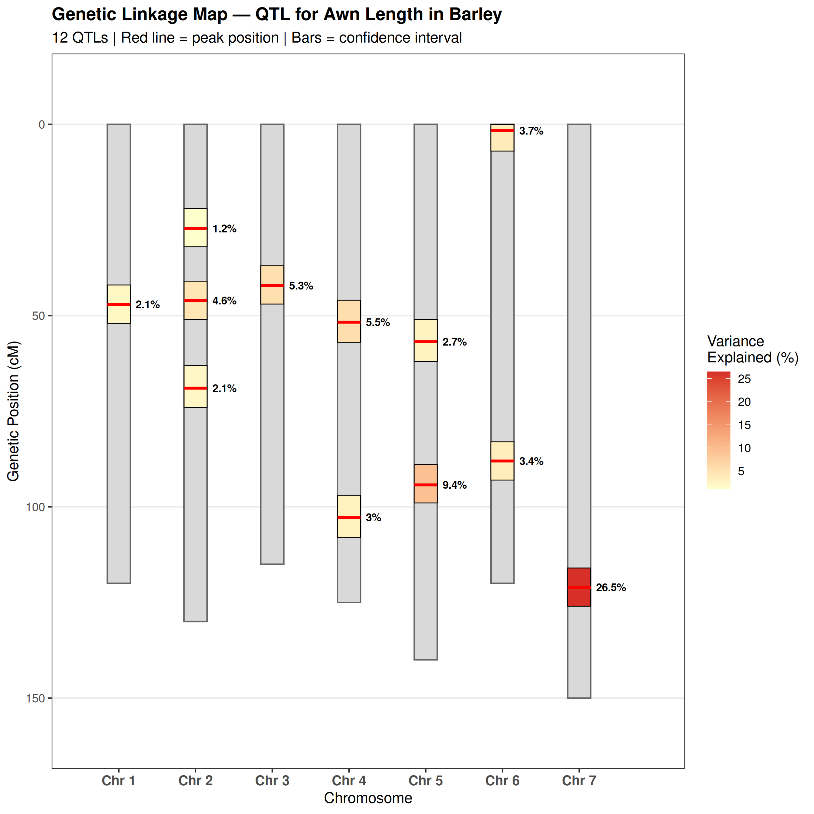
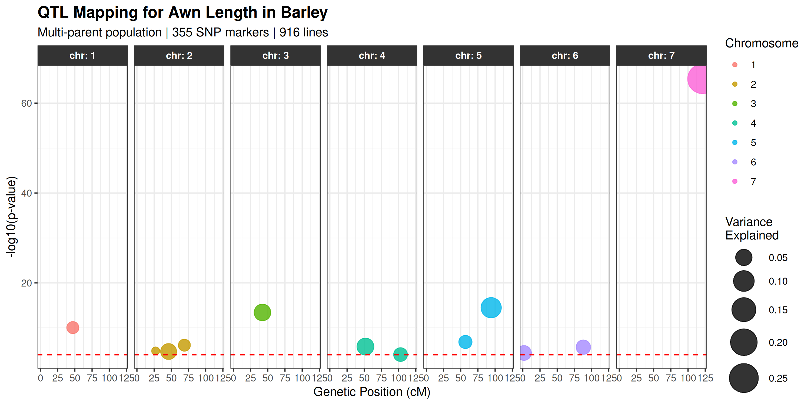
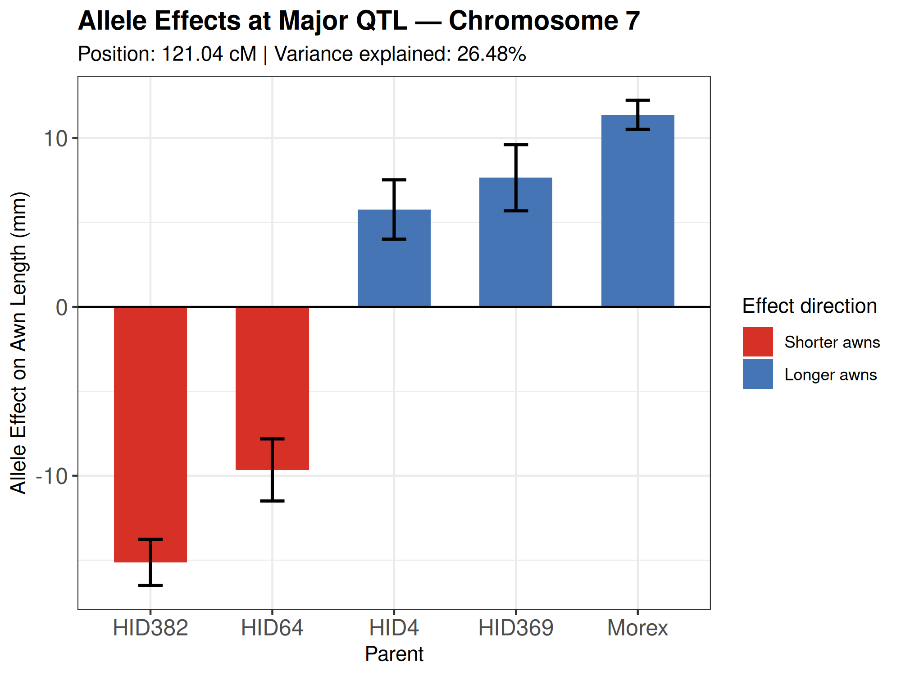
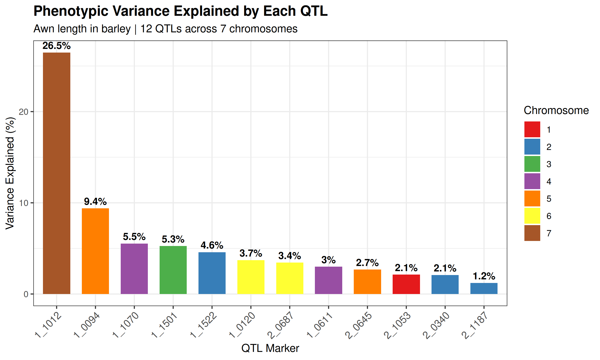
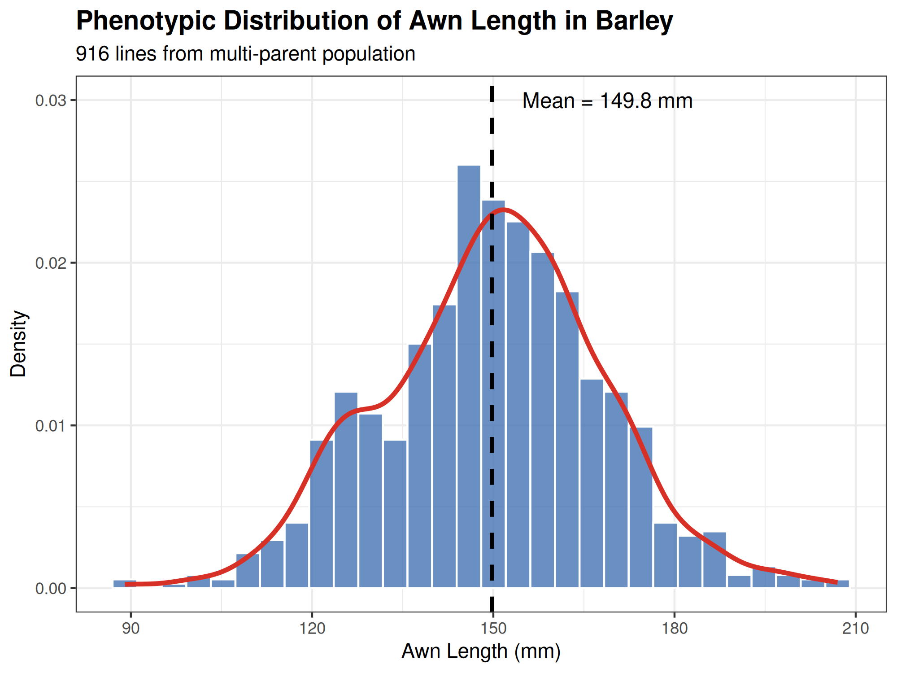
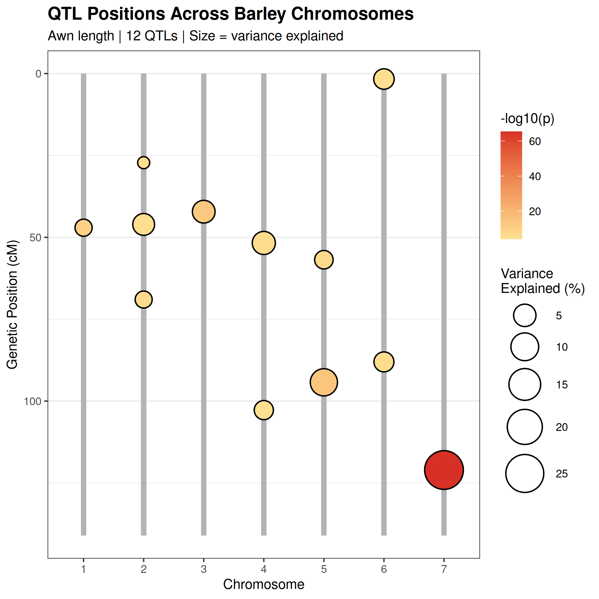
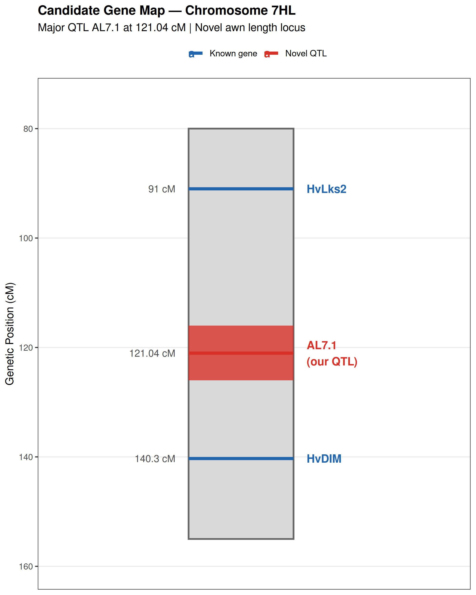

# 🌾 Barley Awn Length — QTL Mapping

### Genetic dissection of awn length in a barley multi-parent population

---

## 🔬 Overview
This project performs QTL mapping for awn length in barley (*Hordeum vulgare*)
using a multi-parent population. The analysis identifies genomic regions 
controlling awn development, quantifies allele effects across parent lines,
and provides a fully reproducible R pipeline with publication-quality figures.

This work demonstrates transferable computational skills in quantitative 
genetics directly applicable to plant ecological genetics research.

---

## 📊 Dataset
- **Population:** Multi-parent barley population (Liller et al. 2017)
- **Lines:** 916 barley accessions
- **Markers:** 355 SNP markers across 7 chromosomes
- **Trait:** Awn length (mm)
- **Data source:** `statgenMPP` R package

---

## 🔁 Pipeline
1. **Phenotypic analysis** — distribution, summary statistics
2. **QTL mapping** — multi-parent QTL mapping with threshold LOD = 4
3. **Allele effect estimation** — per parent allele effects at significant QTLs
4. **Candidate gene identification** — Chr 7 major QTL region
5. **Visualization** — publication-quality figures in ggplot2

---

## 📈 Key Results
- 12 QTLs detected across all 7 barley chromosomes
- Major QTL on chromosome 7 (position 121.04 cM) explaining **26.48%** of phenotypic variance
- Allele effects range from -15.1 mm (HID382) to +11.4 mm (Morex)
- Mean awn length: 149.8 mm (range: 89-207 mm)
- Novel locus AL7.1 fine mapped to less than 0.9 cM interval

---

## 🖼️ Figures

### Genetic Linkage Map

### QTL Bubble Plot

### Allele Effects at Major QTL — Chromosome 7

### Variance Explained by Each QTL

### Phenotype Distribution

### QTL Chromosome Position Map

### Candidate Gene Map — Chromosome 7HL

---

## 🛠️ Tools & Packages
**R:** `statgenMPP`, `ggplot2`, `dplyr`

---

## 📁 Repository Structure
- scripts/qtl/ — QTL mapping R scripts
- results/figures/ — publication-quality PNG figures
- results/tables/ — QTL results and candidate gene tables
- data/raw/ — raw data files
- data/processed/ — processed data files

---

## 📄 Status
✅ Phase 1: QTL mapping complete — 7 publication figures produced
✅ Phase 2: Candidate gene identification complete
🔄 Phase 3: RNA-seq validation (planned)

---

## 📚 Reference
Liller CB et al. (2017) Fine mapping of a major QTL for awn length in barley
using a multiparent mapping population. *Theoretical and Applied Genetics.*
doi:10.1007/s00122-016-2807-y

---

## 👤 Author
Divya Bhanu Sharma | Plant Geneticist & Bioinformatics Researcher
Independent research | 2026
